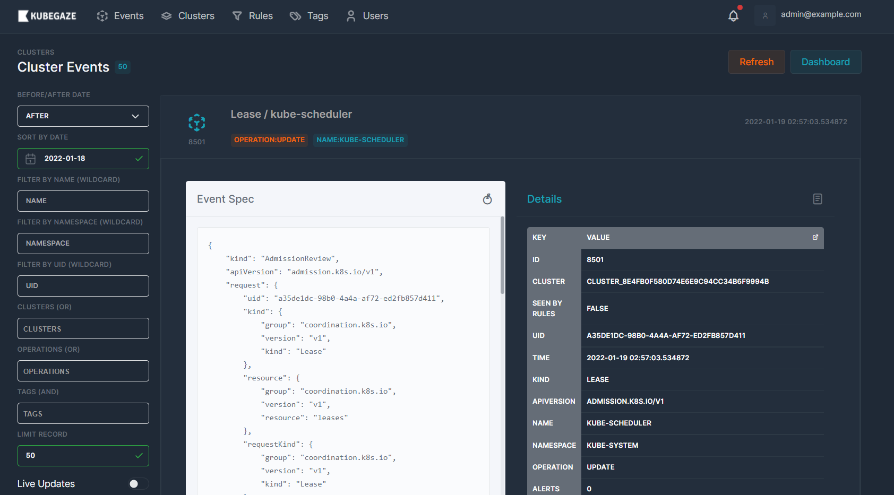
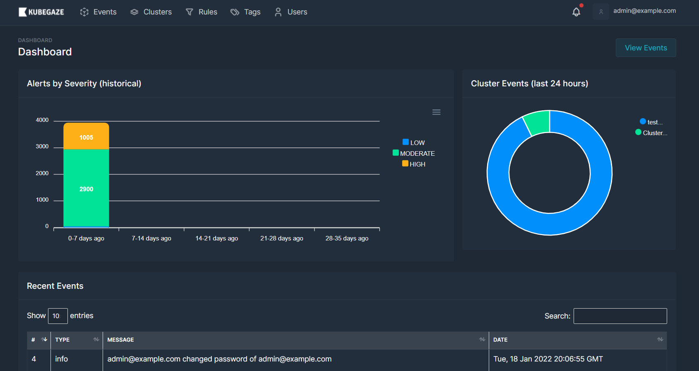
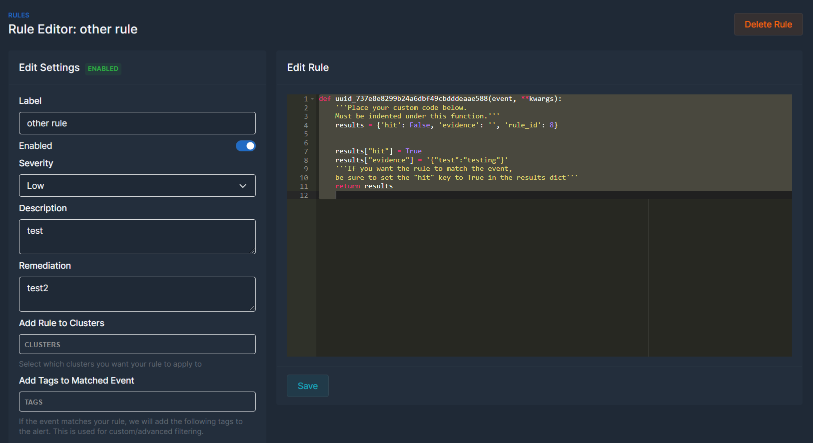
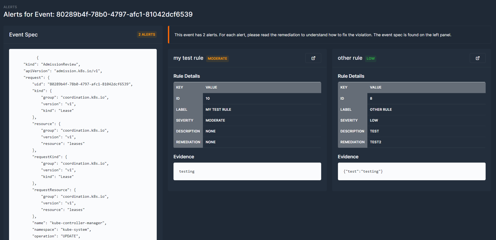

  

#### Get started in 1 minute!

### Table of Contents
1. [What is KubeGaze?](#what-is-kubegaze)
2. [Use Case](#use-case)
3. [How it Works](#how-it-works)
4. [Getting Started](#getting-started)

Stream and filter events          |  
:-------------------------:|
  |

High level dashboards          |  
:-------------------------:|
  |

Create custom/dynamic alerts          |  
:-------------------------:|
  |

View alerts for your k8 events          |  
:-------------------------:|
  |

### What is KubeGaze

KubeGaze is a security monitoring tool for Kubernetes clusters. At a high level, it consumes events from your cluster and allows you to write rules/alerts that trigger on specific events. For example, if someone tries to deploy a container running as root or pulling a image from a unauthorized registry, you can trigger on that. The beauty of KubeGaze is that the rule engine is just very basic Python code. No need to learn another language. Also, KubeGaze has an agent/server model so it can support any number of clusters.

### Use Case

The most popular use case is likely a security monitoring (CSIRT) team that wants to monitor all of their Kubernetes clusters at scale. You can organize all your rules in a single place and create basic or complex rules.

### How it Works

KubeGaze supports an agent/server model. You install the agent (which is just a K8 Admission Webhook) in your cluster and the server portion can be deployed anywhere. Once the webhook is installed, it forwards events from the Kubernetes API server to the server portion. This allows you to deploy it anywhere and consolidate events from all of your clusters.

### Getting Started

#### Getting the cluster started
sudo snap install microk8s --classic
sudo microk8s.status --wait-ready
sudo microk8s.config
sudo microk8s.kubectl cluster-info
sudo microk8s.kubectl get pods --all-namespaces

#### Starting deployment
- `invoke generate_keys webhook webhook`
- copy cert to config/validate.yml file
- `microk8s.kubectl --namespace=webhook create secret tls webhook-certs --cert=keys/server.crt --key=keys/server.key`
- `microk8s.kubectl apply -f config/deployment.yaml`
- `microk8s.kubectl apply -f config/validate.yaml`

#### Debug
microk8s.kubectl get validatingwebhookconfigurations
microk8s.kubectl delete validatingwebhookconfigurations.admissionregistration.k8s.io validating-webhook
microk8s.kubectl delete secret webhook-certs -n webhook
microk8s.kubectl delete deployments webhook -n webhoo
microk8s.kubectl exec --stdin --tty webhook-8647f75dd6-gprxb -n webhook -- bash
invoke generate_keys webhook webhook
openssl x509 -text -noout -in keys/server.crt
microk8s.kubectl delete pod nginx --grace-period=0 --force
microk8s.kubectl logs webhook-7b49f7f5b-xkkgm -n webhook -f

##### Check admission compat
microk8s.kubectl api-versions | grep admissionregistration

