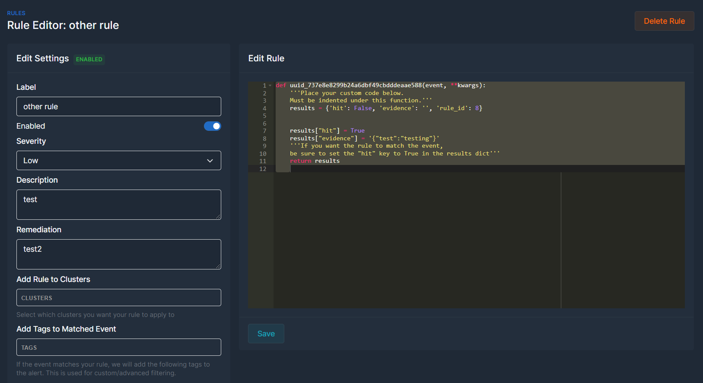

# KubeGaze Documentation

#### Join the discord: https://discord.gg/9unhWAqadg
#### Get started in 1 minute!

Stream, monitor and alert on events from Kubernetes          |  
:-------------------------:|
  |

#### Watch the 30 second video of custom Form automations
https://user-images.githubusercontent.com/26391921/145500806-ee2332b6-52d6-43aa-93b7-6530d66dbcf5.mp4

### Table of Contents
1. [What is KubeGaze?](#what-is-kubegaze)
2. [Use Case](#use-case)
3. [How it Works](#how-it-works)
4. [Getting Started](#getting-started)

Stream and filter events          |  
:-------------------------:|
  |

High level dashboards          |  
:-------------------------:|
  |

Create custom/dynamic alerts          |  
:-------------------------:|
  |

View alerts for your k8 events          |  
:-------------------------:|
  |

### What is KubeGaze

KubeGaze is a security monitoring tool for Kubernetes clusters. At a high level, it consumes events from your cluster and allows you to write rules/alerts that trigger on specific events. For example, if someone tries to deploy a container running as root or pulling a image from a unauthorized registry, you can trigger on that. The beauty of KubeGaze is that the rule engine is just very basic Python code. No need to learn another language. Also, KubeGaze has an agent/server model so it can support any number of clusters.

### Use Case

The most popular use case is likely a security monitoring (CSIRT) team that wants to monitor all of their Kubernetes clusters at scale. You can organize all your rules in a single place and create basic or complex rules.

### How it Works

KubeGaze supports an agent/server model. You install the agent (which is just a K8 Admission Webhook) in your cluster and the server portion can be deployed anywhere. Once the webhook is installed, it forwards events from the Kubernetes API server to the server portion. This allows you to deploy it anywhere and consolidate events from all of your clusters.

### Getting Started

##### Pre-reqs - Make sure you have a Kubernetes cluster running and docker installed on your local machine. We are going to deploy the webhook and the server portion will be installed locally

```
root@alf:~/kubegaze# microk8s.kubectl version
Client Version: version.Info{Major:"1", Minor:"22+", GitVersion:"v1.22.5-3+b58e143d1dbf57", GitCommit:"b58e143d1dbf57f62d11660e24ddcd7f56e5abf3", GitTreeState:"clean", BuildDate:"2022-01-18T14:55:25Z", GoVersion:"go1.16.13", Compiler:"gc", Platform:"linux/amd64"}
Server Version: version.Info{Major:"1", Minor:"22+", GitVersion:"v1.22.5-3+b58e143d1dbf57", GitCommit:"b58e143d1dbf57f62d11660e24ddcd7f56e5abf3", GitTreeState:"clean", BuildDate:"2022-01-18T14:53:07Z", GoVersion:"go1.16.13", Compiler:"gc", Platform:"linux/amd64"}
```

##### Warning: The installation guide below is for a quick set up in Development. The default certs/secrets used within the files should not be used in production and TLS cert validation should be enabled 

##### Install the server
1. Clone the repo
2. Navigate to the `kubegaze/ui` folder
3. Update the `UI_HOST` value in the file `docker-compose.yml` [here](https://github.com/bmarsh9/kubegaze/blob/main/ui/docker-compose.yml#L37) to your server address
4. Run: `docker-compose up -d postgres_db && sleep 10 && docker-compose up -d kubegaze_ui kubegaze_poller` to install the server components
5. After a few seconds, open your browser to `https://your-ip` and the default username:password is `admin@example.com:admin`
6. At this point, you should be logged into the server component
7. Navigate to the `Clusters` tab and click the first cluster's `edit` button. Click `Generate Token` and then the button `Generate`. The token should populate, save this for the agent below in the following steps.

##### Install the agent (webhook container)
1. Clone the repo (if you havent already)
2. Navigate to the `kubegaze` folder (top level directory)
3. Update the `SERVER_URL` value in the file `config/deployment.yaml` [here](https://github.com/bmarsh9/kubegaze/blob/main/config/deployment.yaml#L49) to your server address
4. Update the `TOKEN` value right below it [here](https://github.com/bmarsh9/kubegaze/blob/main/config/deployment.yaml#L51). The token is generated in the `Install the server` section (step 7 above)
5. (Back in top level directory) Create secret: `kubectl --namespace=webhook create secret tls webhook-certs --cert=keys/server.crt --key=keys/server.key`
6. Apply the webhook deployment (check logs of the deployed pod for errors): `kubectl apply -f config/deployment.yaml`
7. Apply the webhook configuration: `kubectl apply -f config/validate.yaml`

If all goes smoothly, you can head back to the `Events` page in the server portion and you should see events flowing in.
